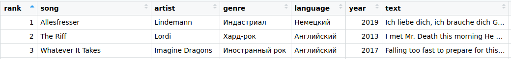

```{r setup, include=FALSE}
knitr::opts_chunk$set(echo = FALSE)
source("Script.R")
```

Я уже несколько месяцев (с августа, наверное) не писал научных статей. Как-то не могу собраться, сесть и начать работать. А прямо сейчас, перед Новым годом, вообще на серьёзные и сложные вещи не тянет. К счастью, потянуло на несложные и несерьёзные, поэтому решил написать не совсем серьёзную и не совсем научную статью, которая, тем не менее, основана на тех же методах, что серьёзные и научные. Я не буду занудно делить её на «Введение»,«Методику», «Результаты» и «Обсуждение», потому что так скучно и сложно, а просто напишу сплошным текстом с кучей картинок. Поехали!

В конце каждого года Яндекс-музыка подводит итоги: какие песни, альбомы и исполнителей слушали за год больше всего. Появились такие итоги и за 2020-й год. Открыв их, я понял, что у меня, видимо, довольно своеобразные вкусы: из 100 самых популярных треков у меня только одно попадание. Нет, я не в том плане, что остальные 99 вообще прошли мимо меня — о части из них я слышал, а из каких-то даже вспомню пару строчек, но вот так, чтобы песня мне конкретно нравилась и была у меня в плейлисте, и одновременно в топе-100 — такая только одна. С альбомами чуть лучше вышло, но оно понятно: в альбме обычно несколько песен, и если хоть какая-то совпала, то и весь альбом совпал. Впрочем, дело не совсем в этом.

Яндекс-музыка подводит ещё и личные итоги года, на которые я тоже внимательно смотрю. Так что одновременно со списками лучших за год у меня появился свой личный плейлист 2020 года. В него Яндекс поместил 50 песен. Я открыл его, немного удивился, полистал туда-сюда, и в моей голове начали возникать мысли… А что если взять да проанализировать этот плейлист статистически? Ну а что, смотрите: у нас есть 50 треков, к каждому можно подсобрать метаданные: исполнитель, жанр, год, язык, что ещё… А дальше посмотреть, кто любимый исполнитель, какой год круче всего и всё такое.

По идее это такой качественный доказательный подход: я могу сколько угодно говорить, что мой любимый жанр — А, любимая группа — Б, любимая песня — В, а вот Г и Д я ни за что слушать не буду, а что касается Е — ну, разве что по настроению. Но кто сказал, что я хорошо себя знаю? Год — это много, я уже забыл даже, что в начале года делал, не говоря уже о том, какую музыку слушал, и тот факт, что я сейча залипаю под группу Л, не говорит, что я весь год только её и слушал. В общем, посчитать — неплохая идея, а тут и данные для подсчётов сами собой подъехали. Словом, считаем.

Первый этап количественного исследования — собрать данные. Собираем. Конечно, идеал — это если бы Яндекс-музыка отдавала всю статистику прослушиваний за весь год в готовом csv-файле, где сразу всё есть, но мечты, мечты… Поэтому придётся собрать данные самому. К счастью, треков всего 50, поэтому вбор вручную — не самая сложная задача. Просто пишем в табличку номер трека в плейлисте, название, группу. Далее переходим на страницу трека, записываем жанр и год. Жанр пишем ровно так, как на Яндекс-музыке. Я понимаю, что там, наверное, не всё идеально, и, честно говоря, меня обилие «иностранного рока» смущает — что это за жанр такой, не слишком ли общее название? Но сам я не умею лучше определять жанры, поэтому пусть будет так, как там. С годом тоже есть хитрость: у новых песен он будет правильный, а те, что постарее, могут идти в переизданиях, а нам нужен год первого выхода, так что проверяем по «Википедии». Что ещё? Ну, можно указать язык: тоже интересно. Ничего специально не ищем, потому что вариантов немного, да и так понятно, на каком языке поётся. Наконец, добавим колонку с текстом: это позволи в конце сделать кое-что интересное. Текст по большей части копировал с Яндекс-музыки, иногда просто искал в интернете. Для трёх песен на финском текста не нашёл: исполнитель не очень известный, и язык — тоже. Оставил пустыми.

В общем, получил вот такую таблицу.



Что теперь? Конечно, берём эту таблицу и анализируем! Вот только как лучше всего это сделать?

Конечно, есть самый простой вариант: посчитать как есть. Надо сказать, он тоже даёт некоторые результаты. Например, можно легко определить, что исполнителей у этих 50 песен `r n_artists` — в среднем получается `r songs_per_artist` треков на исполнителя. Что ж, разнообразие неплохое: нельзя сказать, что кого-то одного весь год слушал. Или ещё можно сказать, что почти все исполнители делятся на две группы: поменьше — те, у которых в моём плейлисте по три песни, и побольше — те, у которых по одной песне. И ещё между ними затесалась одна группа с двумя песнями. Ещё легко понять, что больше всего песен на английском — `r songs_in_english`. На немецком — `r songs_in_german`, на русском — `r songs_in_russian`, и ещё затесалось `r songs_in_finnish` песни на финском.

Но есть одна тонкость. Мы считаем песни так, как будто они все равнозначны. А на самом деле у нас плейлист, в котором песни идут в определённом порядке. И вот тут на самом деле я не знаю точно, почему они идут именно в таком порядке. Легко подумать, будто это просто топ-50 самых прослушиваемых треков за год. Но это вряд ли, потому что в плейлисте есть и такие песни, которые я слушал от силы раз-два, при том что те песни, которые у меня крутились на протяжении месяца каждый день, в него не попали. Похоже, что Яндекс собирал итоговый плейлист по какому-то хитрому алгоритму, где учитывается не только количество прослушиваний (а может быть, количество прослушиваний вовсе не учитывается). Но так или иначе, я полагаю, что песни в плейлисте идут от самых важных к менее важным, пусть даже эта важность определяется непонятно как. В общем, это означает ровно одно: песни не равнозначны, и эту неравнозначность нужно учитывать.

Как можно сделать поправку на то, что одни песни важнее других? Добавить веса. Проще говоря, указать у каждой песни какое-то число, которое характеризует её важность. И дальше если у нас получится, например, две песни с весами 2 и 3 и одна песня с весом 7, то одна песня «перевесит» две остальные, потому что 7 больше, чем 5 (2+3).

Подобрать веса можно по-разному. Например, просто по номерам: дать первой песне вес 50, второй 49, и так далее до последей, у которой будет вес 1. Можно дать вес, обратный номеру: 1/1, 1/2, 1/3… Правда, первый вариант слишком прямолинейный, а во втором случае получается слишком большие разрывы в начале: вес второй песни аж в два раза меньше, чем вес первой. Я экспериментировал с вариантами вида «один на корень пятой степени из номера песни», но они тоже не зашли :) В общем, в какой-то момент я додумался до логистической функции. Это когда вес изменяется вот так.

```{r}
weights_plot
```

По-моему, такой график лучше всего соответствует субъективной важности песен: в начале они все в целом довольно важные, потом в какой-то момент важность начинает уменьшаться, и далее те песни, которые в конце плейлиста, тоже примерно одинаковой важности, но уже небольшой. У первой песни вес получается почти равен единице, у последней — почти нулю.

Теперь, когда мы расставили веса, можно наконец-то перейти к самому интересному: какие за год главные исполнители, жанры, языки и что там по годам.

Что ж, начнём с исполнителей. Если помните, то первые три песни шли так: Lindemann, Lordi, Imagine Dragons. Как думаете, кто три первых исполнителя?

```{r}
artists_plot
```

Правильный ответ: Lindemann, Lordi и Imagine Dragons. Ну, ещё Rammstein очень близко, но всё же на четвёртом месте. Sampsa Astala, который на пятом месте, вообще выглядит как прорыв года, потому что у него всего-то 16 треков вообще, и впервые я стал слушать его песни каких-то полтора месяца назад, а он вот где — уже на пятом месте. Ну, дальше там ещё несколько относительно популярных групп, а потом с некоторого момента идут группы одной песни — не вообще, конечно, а конкретно если говорить о моём плейлисте.

Переходим к жанрам. Тут Rock Hallelujah, а возможно, и Hard Rock Hallelujah.

```{r}
genres_plot
```

О языках я уже говорил, но любопытно посмотреть, влияют ли веса. И они влияют!

```{r}
languages_plot
```

Английский так и остался на первом месте, но посмотрите на двукратный разрыв между немецким и русским: по количеству песен они различаются всего на одну, но веса сделали своё дело. И ещё финский почти сравнялся с русским, хотя песен на финском только три, а на русском — целых семь.

Теперь посмотрим на года выхода песен.

```{r}
years_plot
```

Я нарисовал две линии: полупрозрачная — это исходная линия, жирная — это сглаженные данные. Без сглаживания получается слишком много резких пиков из-за того, что в некоторые годы песен нет.

Что ж, на первый взгляд, это всё, что можно было выжать из этого небольшого набора данных. Но я не зря в начале сказал про тексты песен. По текстам можно сделать как минимум одну забавную штуку: посмотреть, какие слова в текстах встречаются чаще всего.

Я не стал анализировать песни на русском и немецком, потому что их слишком мало для каких-то нормальных выводов. Ну ладно, скажу совсем честно: я их проанализировал и понял, что результат получается скучный: по-русски самое часто слово — «внутри», потому что, видимо, оно то и дело повторяется в песне Distemper «Ты настоящий лишь внутри». Внутри, внутри. По-немецки — так и вовсе Moskau благодаря «Чингисхану» и его песне Moskau. Если что, то на втором месте не лучше: allesfresser из одноимённой песни Lindemann. А вот песен на английском 32, и этого, наверное, достаточно для более-менее адекватных результатов.

Отмечу некоторые технические тонкости такого анализа: все слова приводятся к начальной форме. Это нужно, чтобы, например, слова play, plays, played и playing не были посчитаны как четыре разных слова, а свелись к одному слову play. Кроме того, из текстов удаляются стоп-слова: это самые часто встречающиеся слова, не несущие большого смысла, например, I, he, is, a, the. А в остальном просто считается количество слов.

Надо заметить, что считать количество слов тоже можно по-хитрому: с весами. Наиболее популярный способ расставить веса — это так называемый tf-idf, что значит «term frequency / inversed document frequency». Смысл в том, что некоторые слова часто встречаются не только в тексте данной песни — они вообще часто используются. А некоторые слова встречаются редко, но и сами по себе редко используются, и этот самый tf-idf позволяет придать больший вес тем словам, которые редко используются. Но я попробовал так сделать — получилось не очень хорошо. Ещё, пожалуй, можно было бы использовать веса песен: если слово из песни, которая на втором месте, то у него вес больше, чем у слова из пятнадцатой песни. Однако, по-моему, так слишком легко запутаться. И вообще вот тут уже не факт, что важность слов зависит от важности песни: некоторые ценные цитаты есть в песнях из последней десятки, и для меня эти фразы важнее, чем строчки из первых пяти песен. Словом, тут я не стал заморачиваться с весами и просто нашёл самые популярные слова из текстов песен, а потом нарисовал их в виде так называемого «облака слов». Вот как оно выглядит.

```{r}
word_cloud
```

Если честно, то меня самого такое облако о-о-о-чень сильно удивило. Ни за что бы не подумал, что слова heart, take и feel будут самыми частыми.


