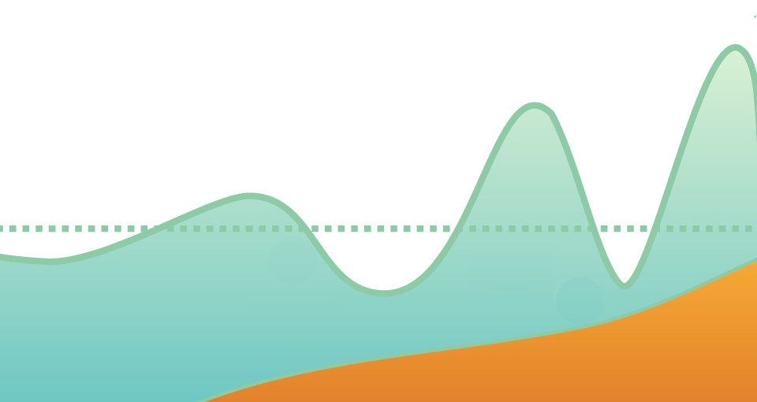

```{r setup, include=FALSE}
knitr::opts_chunk$set(echo = FALSE)
source("Script.R")
```

Иногда я пишу научные статьи. Но перед Новым годом хочется немного отвлечься от звериной серьёзности науки. Значит, можно написать несерьёзную и не совсем научную! Но — основанную на данных и их статистическом анализе, с графиками и воспроизводимыми результатами.

## Введение

В конце года Яндекс-музыка подводит итоги: самые популярные песни, альбомы и исполнители. Я открыл [итоги за 2020-й](https://zen.yandex.ru/media/yandexmusic/muzykalnye-itogi-2020-chto-slushala-rossiia-v-etom-godu-5fd7569c33ed420c3fc25e2d) и понял, что у меня специфические вкусы: на 100 треков — одно совпадение. Впрочем, чему я удивляюсь? И так понятно, что мой любимый жанр — A, мои любимые группы — B и C, а вот эти все D, E, F, G, H я как-то не очень принимаю. Но хорошо ли я разбираюсь в своих музыкальных вкусах? Не помню даже, что я делал в начале года, а уж какая музыка мне тогда нравилась — и подавно… К счастью, есть количественные методы, которые помогут пролить свет на загадки моих предпочтений в музыке.

Яндекс-музыка сделала не только общие, но и личные итоги. У меня появился плейлист «Мой 2020». В нём 50 треков. Можно проанализировать его статистически и посмотреть, каких исполнителей и жанров там больше всего, когда вышли песни, на каком языке написаны тексты и какие слова в них наиболее часто встречаются.

## Данные и методы

Сначала нужно собрать данные. Я перенёс в таблицу порядковые номера в плейлисте, названия треков и исполнителей, потом зашёл на страницу каждого трека и выписал жанр. С годом выхода пришлось повозиться: некоторые старые песни идут в переизданиях, поэтому уточнял по Википедии. С языком, наоборот, всё сразу понятно. Ещё я сделал колонку с текстом: его тоже можно проанализировать. Для трёх песен на финском текста не нашёл — оставил поля пустыми. Если бы песен было не 50, а 500, то сбор данных пришлось бы автоматизировать, а так справился вручную. Таблица в итоге выглядит примерно так.


Теперь берём эту таблицу и анализируем. Вот только как лучше всего это сделать?

Самый простой вариант — посчитать как есть. Надо сказать, такой способ тоже даёт некоторые результаты. Например, в плейлисте `r n_artists` исполнителей — в среднем получается `r format(songs_per_artist, digits = 2, decimal.mark = ",")` треков на каждого. Что ж, относительное разнообразие. При этом на исполнителя приходится либо одна песня (таких 15), либо три (таких 11), и только у одной группы в плейлисте две песни. Кроме того, можно сделать вывод, что больше всего песен на английском — `r languages_no_weights["Английский"]`. На немецком — `r languages_no_weights["Немецкий"]`, на русском — `r languages_no_weights["Русский"]`, и ещё есть `r languages_no_weights["Финский"]` песни на финском.

Но есть тонкость. Мы считаем песни так, как будто они равнозначны. А на самом деле у нас плейлист, в котором песни идут в определённом порядке. Я не знаю, почему они расположены именно так. Легче всего предположить, будто это топ-50 самых прослушиваемых треков за год. Но вряд ли: в плейлисте есть песни, которые я включал раз-другой, но нет тех, которые играли каждый день в течение месяца. Похоже, что Яндекс собирал плейлист по хитрому алгоритму, где порядковый номер песни зависит не только от количества прослушиваний. А может быть, количество прослушиваний вовсе не имеет значения. Но так или иначе, я полагаю, что песни в плейлисте идут от самых важных к менее важным, пусть даже эта важность определяется непонятно как. Следовательно, песни не равнозначны, и неравнозначность нужно учитывать.

Как сделать поправку на то, что одни песни важнее других? Добавить веса. Проще говоря, написать рядом с каждой песней число, которое характеризует её важность. Например, если есть две песни с весами 2 и 3 и одна песня с весом 7, то одна песня «перевесит» две остальные, потому что её вес (7) больше, чем суммарный вес двух других (5).

Подобрать веса можно по-разному. Я перепробовал кучу вариантов.

```{r}
weights_variants_plot
```

В итоге остановился на таком.

```{r}
weights_plot
```

Это логистическая функция. По-моему, такой график лучше всего характеризует субъективную важность песен: в начале у всех примерно одинаковый и большой вес, потом в какой-то момент важность начинает резко  уменьшаться, а в конце плейлиста вес снова примерно одинаковый, но уже небольшой. Вес первой песни — почти единица, последней — почти ноль, средней — ровно 0,5.

Теперь, когда мы расставили веса, переходим к нормальному анализу.

## Результаты

Начнём с исполнителей. Если помните, у первых трёх песен в таблице с данными исполнители шли в таком порядке: Lindemann, Lordi, Imagine Dragons. Как думаете, кто три первые исполнителя по суммарному весу песен?

```{r}
artists_plot
```

Правильный ответ: Lindemann, Lordi и Imagine Dragons. Ещё Rammstein очень близко, но всё же на четвёртом месте. Sampsa Astala, который на пятом месте, выглядит как мой личный «прорыв года», потому что у него всего-то 16 песен вообще, и первую из них я послушал полтора месяца назад — а он за эти полтора месяца забрался аж на пятое место.

Переходим к жанрам. Тут Industrial & Rock Hallelujah, а возможно, и Hard Rock Hallelujah.

```{r}
genres_plot
```

Я понимаю, что с жанрами, наверное, не всё идеально. «Иностранной рок» и «поп» меня смущают — не слишком ли общие название? Но сам я плохо разбираюсь в жанрах, поэтому оставил так, как на Яндекс-музыке.

О языках я уже говорил, но любопытно посмотреть, влияют ли веса. И они влияют!

```{r}
languages_plot
```

Английский остался на первом месте, но посмотрите на двукратный разрыв между немецким и русским: по количеству песен они различаются всего на одну, но веса изменили это соотношение. Финский почти сравнялся с русским, хотя песен на финском только три, а на русском — целых семь.

Наконец, нарисуем график с годами выхода песен.

```{r}
years_plot
```

Я нарисовал две линии: тонкую — без сглаживания, жирную — со сглаживанием. Без сглаживания слишком много острых «пиков» — со сглаживанием хронологию видно лучше. Мне немного напомнило схему волны цунами: в океане она невысокая, потом к берегу растёт.



Интересно тогда, где там в прошлом лежит «эпицентр землетрясения», которое породило эту волну? В 60-х? В джазе? (Я догадываюсь, какой должен быть ответ, но не скажу.)

На первый взгляд, это все результаты, которые можно было выжать из моего небольшого набора данных. Хотя нет, есть ещё тексты. С текстами можно сделать как минимум одну забавную штуку: посмотреть, какие слова встречаются чаще всего.

Я не анализировал тексты на русском и немецком, потому что их мало. Ну ладно, если совсем честно, то я их проанализировал и понял, что результат искажённый. По-русски самое частое слово — «внутри», потому что Distemper поёт: «Ты настоящий лишь внутри, внутри, внутри». В немецких текстах на первом месте Moskau благодаря «Чингисхану», а на втором — allesfresser из одноимённой песни Lindemann. Песен на английском 32, поэтому результаты должны меньше зависеть от слов, которые повторяются в отдельных песнях.

Отмечу две технические подробности анализа. Во-первых, слова приводятся к начальной форме. Это нужно, чтобы посчитать listen, listens, listened и listening как одно слово listen. Во-вторых, из текстов удаляются стоп-слова — те, которые встречаются чаще всего и не несут большого смысла, например: I, he, is, a, the.

Я считал по-разному: сначала просто количество слов, потом tf-idf. Tf-idf значит «term frequency / inversed document frequency». Это тоже способ расставить веса, только не песням, а словам. Некоторые слова часто встречаются не только в тексте данной песни — они вообще часто используются. А некоторые слова встречаются редко, но и сами по себе редко используются. Tf-idf позволяет придать больший вес тем словам, которые редко используются, но важны для конкретного текста. Ещё, пожалуй, можно было бы использовать веса песен: у слова из песни, которая на втором месте, вес больше, чем у слова из пятнадцатой песни. Однако, по-моему, так слишком легко запутаться. И вообще не факт, что важность слова зависит от важности песни: некоторые ценные фразы есть в песнях из последней десятки.

Словом, в итоге я просто нашёл самые частые слова в текстах песен и нарисовал их в виде «облака слов».

```{r}
word_cloud
```

Результат анализа текстов оказался несколько неожиданным для меня. Ладно Lindemann, индастриал и английский язык, но я ни за что бы не подумал, что слова heart, take и feel будут самыми частыми. Может, надо было всё-таки с tf-idf считать? Там head и heart окажутся в начале. А потом — языковая экзотика в виде слова countdown из The Final Countdown, а ещё zombie из одноимённой песни The Cranberries… В общем, лучше без tf-idf.

## Выводы

1. Мои представления о собственных музыкальных вкусах несколько отличаются от моих музыкальных вкусов на самом деле. Ну, или как минимум от того, что я слушал в течение 2020 года.

2. Группа года — Lindemann, жанр года — индастриал, песня года — Allesfresser.

3. Чаще всего я слушаю песни на английском, хотя и песнями на других языках не брезгую.

4. Более новые песни для меня в целом важнее, чем вышедшие давно, но и в истории музыки для меня есть несколько значимых периодов.

Вообще же нужно учитывать «подводные камни». Об одном я уже говорил: непонятно, как Яндекс-музыка делала «мой плейлист 2020». Может быть, там всё намешано непонятно как, потому что составляла Могучая нейросеть™ по критериям, которые неизвестны даже разработчикам Яндекса. Второй нюанс: нужно смотреть статистику не только по Яндексу, но ещё и по ВКонтакте и чуть-чуть по Ютуб-музыке.

Цифр по ВКонтакте у меня нет, но навскидку там должно быть много Lordi и Sampsa Astala, а Lindemann, наоборот, меньше. Разрыв между Lindemann и Lordi небольшой, и к тому же Lindemann — это в некотором смысле продолжение Rammstein, а их я начал слушать в 2019, а Lordi — «находка» исключительно 2020-го, потому что до середины 2020-го я был уверен, что кого-кого, а этих не буду слушать никогда. На второе место Lordi вышли всего-то за полгода, а если экстраполировать на год… Словом, выводы нужно скорректировать: группой 2020 года у меня становятся вот эти натуральные чудовища.


Ну ладно — не такие уж и чудовища на самом деле.


Будет интересно сравнить, когда Яндекс-музыка пришлёт письмо с «итогами 2020 года»: они там обычно пишут, какая у тебя любимая группа и песня, а ещё сколько ты всего за год музыки слушал.

## Направления дальнейших исследований

1. Использовать больше методов анализа текста. «Облако слов» неплохо выглядит, но есть куда более продвинутые приёмы: тематическое моделирование и анализ тональности. Первый расскажет, о чём песни, а второй — об их настроении. К сожалению, я пока этими методами не владею. А ещё боюсь, что они не справятся с переносным смыслом и отправят Fish On в «охоту и рыболовство», а AUSLÄNDER — в «туризм и путешествия».

2. Сравнить себя с друзьями.

3. ~~Уговорить ВК и Яндекс сделать общедоступный АПИ, чтобы выкачать всю свою статистику и провести исследование на полном наборе данных.~~ Вряд ли получится, к сожалению.

4. Зарегистрироваться на Last.fm, чтобы не изобретать велосипед.

Напоследок: как и положено количественному воспроизводимому исследованию, все данные и код лежат [у меня на Гитхабе](https://github.com/PavelSyomin/music-2020). Кроме того, картинка на обложке — это тоже график, сделанный с помощью ggplot2.